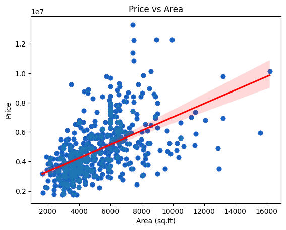

# 🚀 Task 3: Linear Regression (Housing Dataset)

## 📌 Objective
Implement and analyze **Multiple Linear Regression** to predict house prices using the Kaggle Housing Price Prediction dataset.

---

## 🛠️ Tools Used

- Python
- Pandas
- NumPy
- Matplotlib
- Seaborn
- Scikit-learn
- Google Colab

---

## 📊 Dataset

- **Name:** Housing Price Prediction Dataset  
- **Source:** [Kaggle Dataset](https://www.kaggle.com/datasets/harishkumardatalab/housing-price-prediction)
- **Rows:** 545
- **Columns:** 13 (6 numerical, 7 categorical)

---

## 📖 Workflow

1. Loaded and inspected the dataset
2. Encoded categorical variables using `LabelEncoder`
3. Split data into train-test sets (80%-20%)
4. Trained a **Multiple Linear Regression** model using `LinearRegression`
5. Evaluated model performance with:
   - Mean Absolute Error (MAE)
   - Mean Squared Error (MSE)
   - R² Score
6. Extracted feature coefficients
7. Visualized Simple Linear Regression: `Price vs Area`

---

## 📸 Example Visualizations

> 📸 **Price vs Area Scatter Plot with Regression Line**
>
> 

---

## 📚 Key Findings

- Strong positive correlation between **Area** and **Price**
- `airconditioning`, `prefarea`, and `mainroad` positively influence price
- MAE and R² score within a reasonable range for regression on this dataset

---
